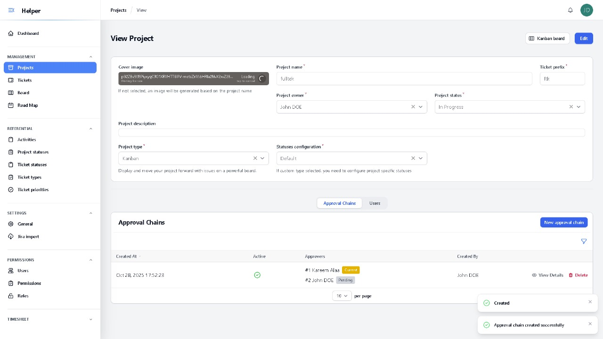
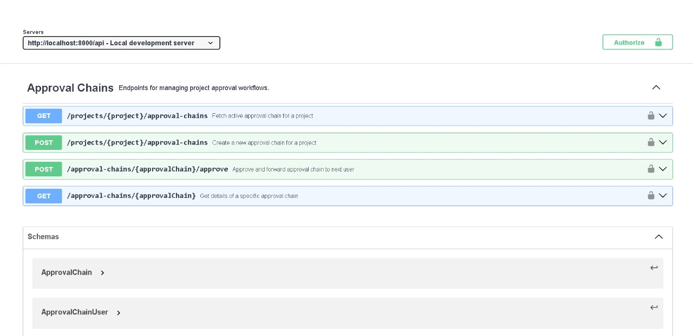

# Approval Chain Feature Submission

## Overview

This submission implements an Approval Chain feature for the project management system, allowing projects to go through a sequential approval process where designated users must approve in order before the project is marked as complete.

## Implementation Approaches

### Primary Approach: Filament-Based Implementation

The primary implementation leverages Filament's Relation Manager pattern, which is the native and preferred approach for this project's architecture. This approach is located in the main codebase.

**Key advantages:**

- **Native Integration**: Seamlessly integrates with the existing Filament admin panel architecture
- **Consistency**: Follows the same patterns used throughout the project (e.g., ProjectUsers, TaskAssignments)
- **Built-in Features**: Leverages Filament's built-in authorization, validation, and UI components
- **Less Code**: Significantly less boilerplate compared to custom API controllers
- **Maintainability**: Easier to maintain as it follows the project's established conventions
- **Type Safety**: Better IDE support and type checking through Filament's form/table builders

**Implementation Details:**

- **Affected Files**: 
    ```
    ├── app\Filament\Resources\ProjectResource\RelationManagers\ApprovalChainsRelationManager.php
    ├── app\Filament\Resources\ProjectResource.php
    ├── app\Models\ApprovalChain.php
    ├── app\Models\ApprovalChainUser.php
    ├── app\Models\Project.php
    ├── database\migrations\2025_10_27_143503_create_approval_chains_table.php
    ├── database\migrations\2025_10_27_143648_create_approval_chain_users_table.php
    ├── database\migrations\2025_10_27_143925_add_completed_status_to_project_statuses.php
    ├── tests\Feature\ApprovalChainTest.php
    ├── database\factories\ApprovalChainFactory.php
    ├── database\factories\ApprovalChainUserFactory.php
    ├── database\factories\ProjectFactory.php
    └── database\factories\ProjectStatusFactory.php
    ```
- Provides full CRUD operations through Filament's admin interface
- Real-time status updates with visual indicators
- Role-based access control using existing project permissions
- Automatic chain deactivation when creating new chains

### Secondary Approach: RESTful API Controllers (Archived)

A traditional REST API implementation was also developed as an alternative approach. This code has been moved to the `archive/` folder for reference.

**Why it's less suitable:**

- **Architectural Mismatch**: The project uses Filament as its primary interface, not traditional REST APIs
- **Additional Overhead**: Requires separate frontend implementation to consume the API
- **Inconsistent Patterns**: Deviates from how other features are implemented

**Archived Files:**
```
archive/
├── ApprovalChainController.php
├── ProjectApprovalChainController.php
├── api_routes.php
└── openapi.yaml
```

## Project Setup

### Prerequisites

- PHP 8+
- MySQL 8+
- Composer
- NPM

### Installation Steps

1. **Clone the repository:**

```bash
git https://github.com/KareemAlaa1/project-management.git
cd project-management
```

2. **Install dependencies:**

```bash
# Backend dependencies
composer install

# Frontend dependencies
npm install
```

3. **Environment Configuration:**

```bash
# Copy environment file
cp .env.example .env
```

4. **Database Setup:**

```bash
# Run migrations
php artisan migrate

# Seed database with default data
php artisan db:seed
```

**Default Admin Credentials:**
- Email: `john.doe@helper.app`
- Password: `Passw@rd`

5. **Build Assets:**

```bash
# For production
npm run build

# For development
npm run dev
```

6. **Serve the application:**

```bash
php artisan serve
```

The application will be available at `http://localhost:8000`

## Approval Chain Feature Usage

### Creating an Approval Chain

1. Navigate to a project in the Filament admin panel
2. Click on the "Approval Chains" tab
3. Click "Create" button
4. Select users in the desired approval sequence
5. The first user selected becomes the initial approver

### Approving and Forwarding

1. Navigate to a project with an active approval chain
2. If you're the current approver, you'll see an "Approve & Forward" button
3. Click the button and confirm
4. The chain automatically moves to the next user
5. When the last user approves, the project is marked as complete

### Viewing Chain Status

The approval chain table shows:
- Sequence number for each approver
- Current status (Pending, Current, Approved)
- Approval timestamps
- Approver information

</img> 
</img> 
</img> 
</img> 
</img> 
</img> 
</img> 
</img> 

### Permissions

- **Create/Delete Chains**: Project owners and managers
- **View Chains**: Project owners, managers, and chain participants
- **Approve**: Only the current approver in sequence

## Database Schema

### New Tables

**approval_chains**
```sql
- id (primary key)
- project_id (foreign key to projects)
- created_by (foreign key to users)
- is_active (boolean)
- created_at, updated_at
```

**approval_chain_users**
```sql
- id (primary key)
- approval_chain_id (foreign key to approval_chains)
- user_id (foreign key to users)
- sequence (integer, approval order)
- is_current (boolean)
- approved_at (timestamp, nullable)
- approved_by (foreign key to users, nullable)
- created_at, updated_at
```

### Relationships

- Project `hasMany` ApprovalChain
- ApprovalChain `belongsTo` Project
- ApprovalChain `hasMany` ApprovalChainUser
- ApprovalChainUser `belongsTo` User
- ApprovalChainUser `belongsTo` ApprovalChain

## Testing

Run the feature tests:

```bash
php artisan test --filter ApprovalChain --coverage-html coverage-report
```

**Test Coverage:**

- ✓ Creating approval chains
- ✓ Validating unique users in chain
- ✓ Sequential approval flow
- ✓ Automatic project completion on final approval
- ✓ Authorization checks
- ✓ Chain deactivation on new chain creation

</img> 
</img> 
## API Documentation

While the primary implementation uses Filament, API endpoints are available through Filament's built-in API. The archived REST API controllers include full OpenAPI/Swagger documentation for reference.

</img> 


